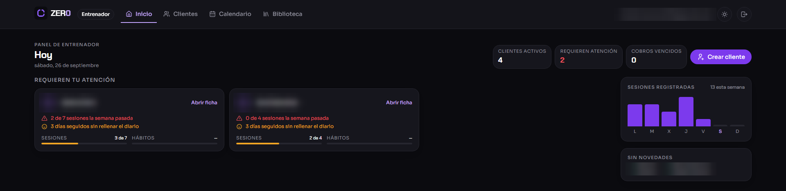
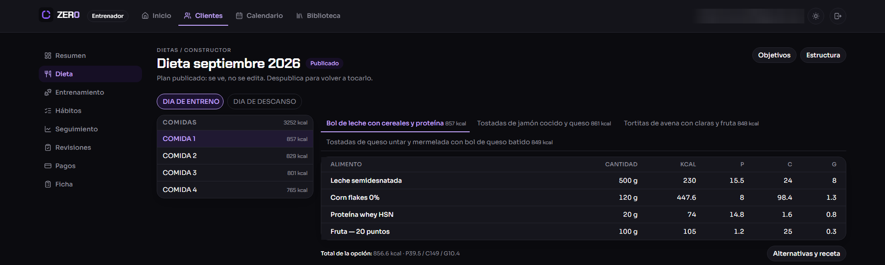
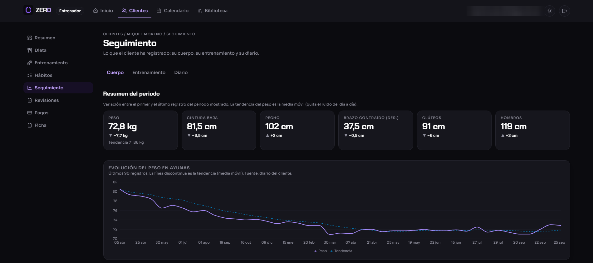

# ZER0 · Plataforma de coaching de fitness y nutrición

Aplicación web en producción para que un equipo de entrenadores gestione a sus clientes: cuestionario inicial, dieta, rutina, seguimiento diario y progreso, todo en un mismo sitio.

> Código privado. Demo disponible bajo petición.

<!-- CAPTURAS: añadir 3 imágenes con datos de demostración (nunca de clientes reales)

-->

## Qué resuelve

Los entrenadores llevaban a cada cliente con hojas de cálculo, PDFs y mensajes sueltos. ZER0 lo reúne en una plataforma con dos accesos: uno para el entrenador y otro para el cliente.

## Qué hace

- **Clientes**: alta por el entrenador (sin registro público) y ficha completa de cada cliente.
- **Cuestionario inicial** que el cliente rellena al empezar.
- **Nutrición**: dietas con cálculo automático de calorías y macronutrientes.
- **Entrenamiento**: rutinas construidas desde una biblioteca de ejercicios.
- **Seguimiento diario**, medidas corporales, fotos de progreso y hábitos.
- **Revisiones** periódicas entre entrenador y cliente.
- **Control interno de pagos**.
- **Panel** con gráficas de evolución.

## Cómo está hecho

| | |
|---|---|
| **Frontend y backend** | Next.js · React · TypeScript |
| **Datos** | PostgreSQL · Prisma |
| **Validación y formularios** | Zod · React Hook Form |
| **Gráficas** | Recharts |
| **Tests** | Vitest · Testing Library |
| **Monitorización** | Sentry |

- **Monolito modular**: cada área (clientes, nutrición, entrenamiento…) es un módulo independiente con su lógica, sus datos y sus tests.
- **Permisos comprobados en el servidor**: cada cliente solo ve sus propios datos. La interfaz nunca decide los permisos.
- **Validación de todo dato de entrada** antes de llegar a la base de datos.
- **Lógica de negocio pura y testeada**: cálculo de macros, métricas y cambios de estado.

## En cifras

| 646 | 70 | 27 | 16 |
|:---:|:---:|:---:|:---:|
| tests automatizados | pantallas | tablas de datos | módulos |

## Mi papel

Diseño y desarrollo de principio a fin: modelo de datos, arquitectura, backend, interfaz, tests y puesta en producción. Desarrollo asistido por IA bajo mi especificación y revisión.

---

[Perfil](https://github.com/miquel-moreno) · [LinkedIn](https://www.linkedin.com/in/miquel-moreno-martinez)
