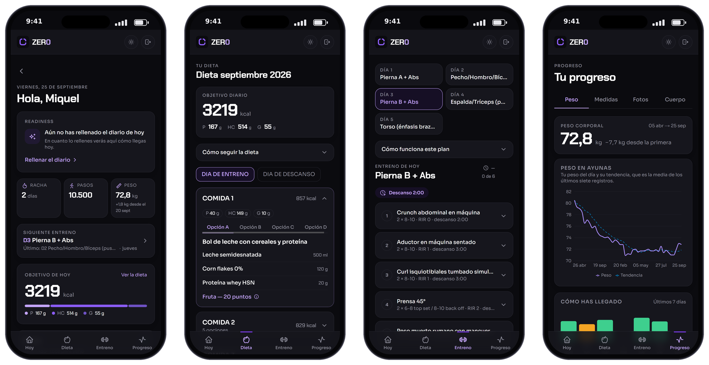
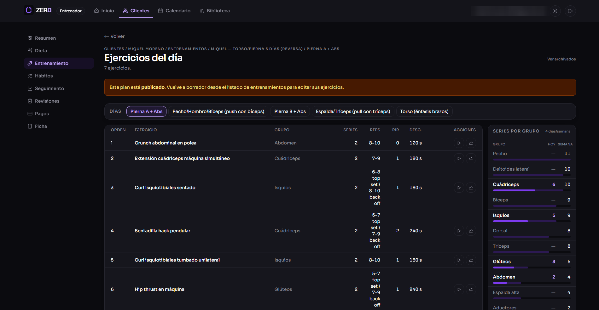

# ZER0 · Plataforma de coaching de fitness y nutrición

Aplicación web en producción para que un equipo de entrenadores gestione a sus clientes: cuestionario inicial, dieta, rutina, seguimiento diario y progreso. Dos accesos: el entrenador trabaja desde el ordenador y el cliente desde el móvil.

> Código privado. Demo disponible bajo petición.

## Qué hace

- **Clientes**: alta por el entrenador, sin registro público, con ficha, cuestionario inicial y revisiones periódicas.
- **Nutrición**: constructor de dietas con cálculo automático de calorías y macronutrientes.
- **Entrenamiento**: rutinas por días desde una biblioteca de ejercicios, con series por grupo muscular.
- **Seguimiento**: registro diario, peso, medidas, fotos de progreso y hábitos, con gráficas de evolución.
- **Pagos**: control interno de cobros por cliente.

## Arquitectura

| | |
|---|---|
| **Aplicación** | Next.js 16 (App Router) · React 19 · TypeScript estricto · Tailwind CSS |
| **Datos** | PostgreSQL · Prisma (27 tablas, 28 migraciones) |
| **Validación** | Zod en cada entrada · React Hook Form |
| **Autenticación** | Auth.js con roles de entrenador y cliente |
| **Archivos** | Almacenamiento compatible con S3 para las fotos de progreso |
| **Monitorización** | Sentry |

- **Monolito modular**: 16 módulos de dominio (clientes, nutrición, entrenamiento, seguimiento…), cada uno con su validación, su lógica, su acceso a datos y sus tests.
- **Permisos en el servidor**: cada acción comprueba el rol y que el cliente pertenece al entrenador. La interfaz nunca decide los permisos.
- **Lógica de negocio pura**: cálculo de macros, métricas y cambios de estado, separados de React y de la base de datos.

## Calidad

- **{TESTS} tests** con Vitest y Testing Library, más tests de integración contra una base de datos aparte.
- Pruebas visuales con Playwright sobre las pantallas principales.
- Cada commit pasa ESLint, Prettier y la comprobación de tipos de TypeScript.

## En cifras

| {TESTS} | 70 | 27 | 16 |
|:---:|:---:|:---:|:---:|
| tests | pantallas | tablas | módulos |

## Mi papel

Diseño y desarrollo de principio a fin: modelo de datos, arquitectura, interfaz, tests y puesta en producción. Desarrollo asistido por IA bajo mi especificación y revisión.

---

[Perfil](https://github.com/miquel-moreno) · [LinkedIn](https://www.linkedin.com/in/miquel-moreno-martinez)
