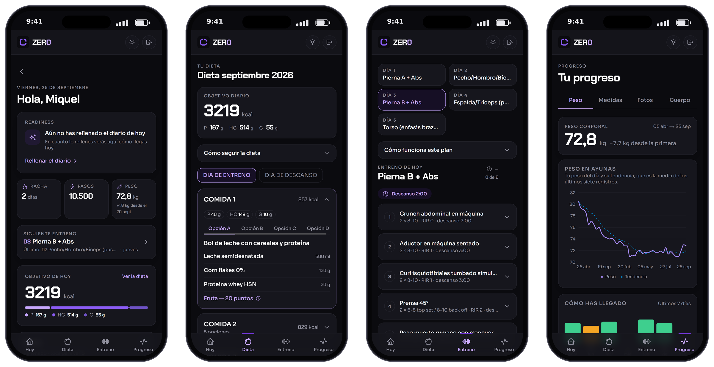

# ZER0 · Coaching de fitness y nutrición

App web en producción: el entrenador gestiona a sus clientes (dieta, rutina y seguimiento) desde el ordenador y el cliente lo sigue desde el móvil.

> Código privado. Demo disponible bajo petición.

## Qué hace

- Alta de clientes, cuestionario inicial y revisiones periódicas.
- Dietas con **cálculo automático de calorías y macros**.
- Rutinas creadas desde una biblioteca de ejercicios.
- Seguimiento diario de peso, medidas, fotos y hábitos, con gráficas.

## Stack

Next.js · React · TypeScript · PostgreSQL · Prisma · Zod · Auth.js · Vitest · Playwright

**+2.000 tests** · 27 tablas · 70 pantallas.

**Decisiones técnicas:** monolito modular en 16 módulos de dominio · permisos comprobados siempre en el servidor · lógica de negocio (macros, métricas) separada de React y de la base de datos.

## Mi papel

Diseño y desarrollo de principio a fin: modelo de datos, arquitectura, interfaz, tests y puesta en producción. Desarrollo asistido por IA bajo mi especificación y revisión.

---

[Perfil](https://github.com/miquel-moreno) · [LinkedIn](https://www.linkedin.com/in/miquel-moreno-martinez)